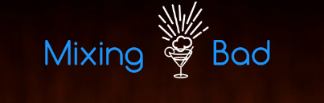
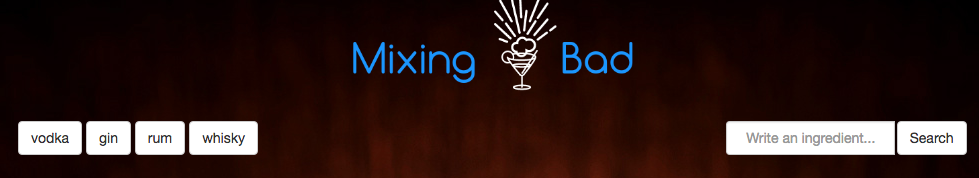
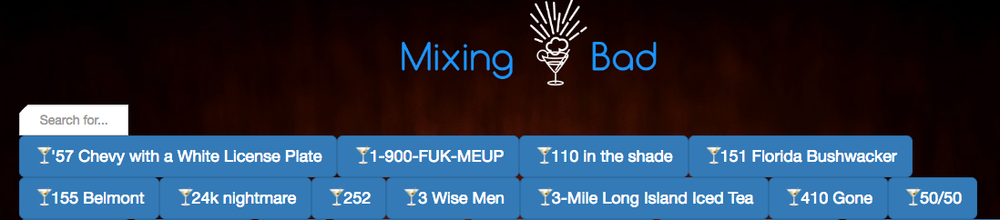
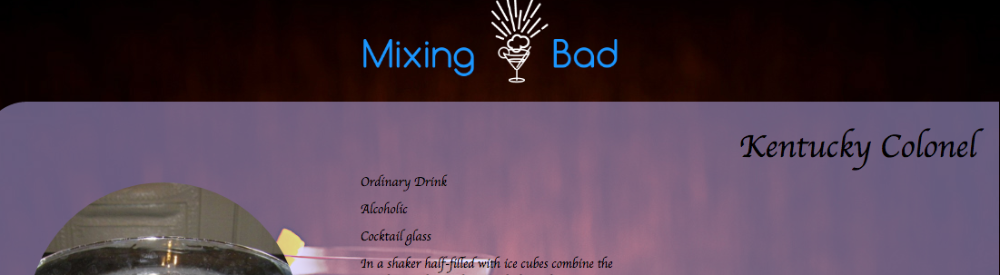

## MIXING BAD

This is a front-end project created to find cocktails recipes as the main objective.
We use the [Cocktail db](http://www.thecocktaildb.com) api as the data source for this educational project.

---

  

---

###Instructions:
In order to run this app in your browser first you need to make a `bower install` from your terminal.

---

###Sections:
- Search By Ingredient: here you will be able to make a cocktail search by some ingredient (right side) or select one from the suggested category (left side).

- Search by Alcoholics: here you will be able to make a cocktail search by this category, showed with a result list and a text field where you can make a dinamic filter.

- Search by No Alcoholics: here you will be able to make a cocktail search by this category, showed with a result list and a text field where you can make a dinamic filter.

- Random Me!: if you are not sure about what cocktail do you want here you can pick a random cocktail recipe.

